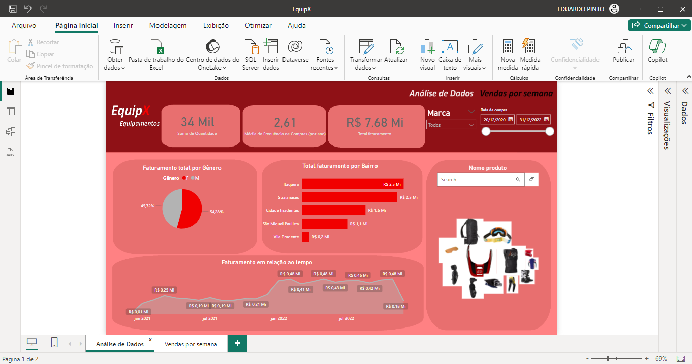
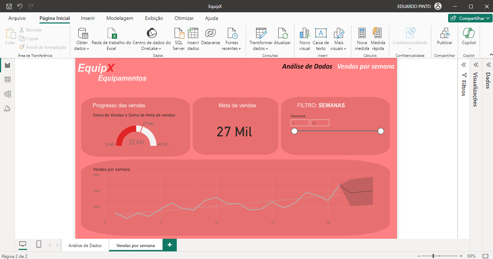
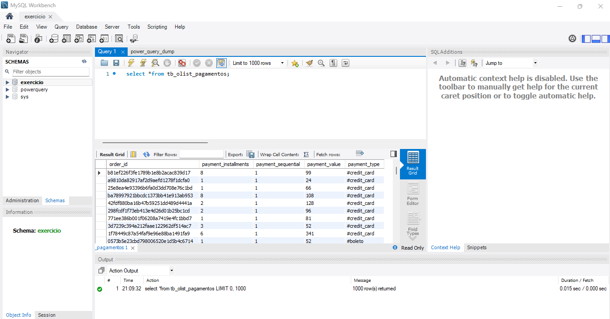

<h1>PowerBi exercício 1 - Equipamentos</h1>

<h2>�� Sobre</h2>

Dashboard criado para praticar os Cursos: 
-Power BI Desktop: construindo meu primeiro dashboard 
-Dashboard com Power BI: visualizando dados 
-Power BI Desktop: tratamento de dados no Power Query 

<h2>Análise de dados:</h2>

<h2>Vendas por semana:</h2>

<h2>Banco de dados:</h2>

<h2>��Formação PowerBi / ALURA</h2>

-Entender o conceito de Business Intelligence 
-Instalar a ferramenta Power BI desktop 
-Importar dados de diferentes formatos e realizar o tratamento deles no Power Query 
-Criar colunas, cálculos e medidas 
-Criar e utilizar gráficos e visuais 
-Montar e estruturar um Dashboard 
-Identificar gráficos apropriados para as necessidades específicas 
-Compreender as possibilidades de como importar visuais externos 
-Aplicar conceitos de data visualization para comunicar informações de form 
-Compreender como trabalhar com séries tempo 
-Sintetizar todos os visuais em um relatório no Power Bi com navegação entre páginas 
-Realizar conexões a arquivos e banco de dados 
-Conhecer e utilizar o Power Query Editor 
-Entender o que é a linguagem M 
-Transformar os dados de diversas formas 
-Realizar tratamentos e carga dos dados visando boas práticas 

<h4>Não apliquei no meu dashboard:</h4>
-Publicar o seu Dashboard na web 
-Elaborar mapas com os conceitos de latitude e longitude 

## �� Tecnologias

  
  

